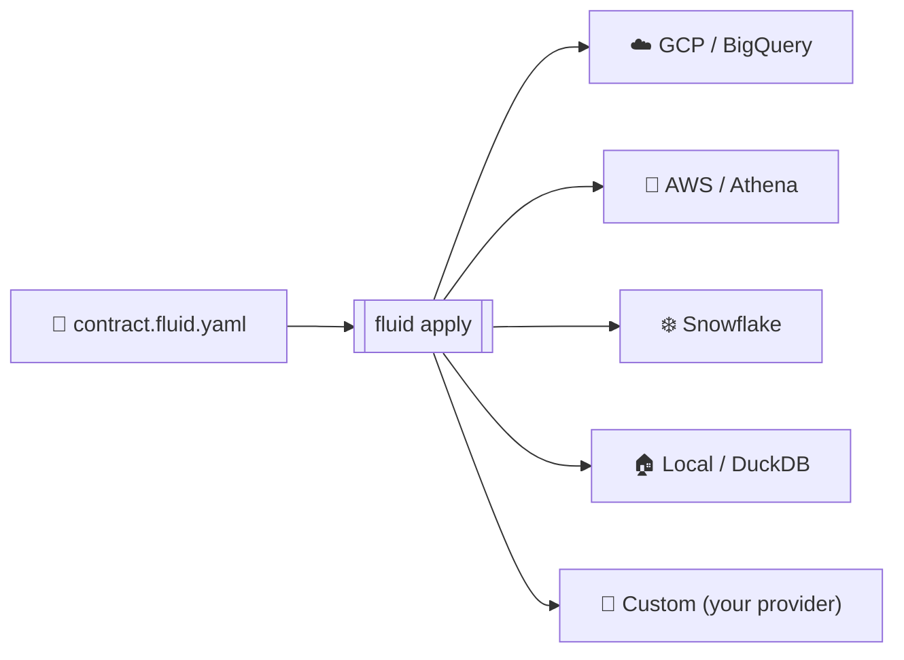

<!-- DESIGNER SLOT: 1200x400 SVG hero illustration goes here when produced.
     Drop the SVG into docs/.vuepress/public/hero.svg and reference it
     from this comment block. Until then, the centered logo below is the hero. -->

<p align="center">
  
</p>

<h1 align="center">Fluid Forge</h1>

<h3 align="center">The data-product layer that doesn't care which cloud you're on.</h3>

<p align="center">
  <em>Write YAML. Deploy Anywhere. Own Your Data Products.</em>
</p>

<p align="center">
  <a href="https://github.com/Agentics-Rising/forge-cli/stargazers"></a>
  &nbsp;
  <a href="https://github.com/Agentics-Rising/forge-cli/network/members"></a>
</p>

<p align="center">
  <a href="https://pypi.org/project/data-product-forge/"></a>
  <a href="https://www.python.org/"></a>
  <a href="LICENSE"></a>
  <a href="https://github.com/Agentics-Rising/forge_docs/actions/workflows/deploy-docs.yml"></a>
  <a href="https://pypi.org/project/data-product-forge/"></a>
  <a href="https://github.com/Agentics-Rising/forge-cli/commits/main"></a>
  <a href="https://github.com/Agentics-Rising/forge-cli/pulls"></a>
  <a href="https://github.com/Agentics-Rising/forge-cli/issues?q=is%3Aopen+is%3Aissue+label%3A%22good+first+issue%22"></a>
</p>

<p align="center">
  
</p>

<p align="center">
  <sub><em>Static placeholder. The animated asciinema cast lands in a follow-up commit on the <a href="https://github.com/Agentics-Rising/forge-cli">forge-cli</a> repo and updates here automatically.</em></sub>
</p>

<p align="center">
  <a href="https://Agentics-Rising.github.io/forge_docs/">📖 Live Docs</a>
  ·
  <a href="https://github.com/Agentics-Rising/forge-cli">⚡ CLI Repository</a>
  ·
  <a href="https://github.com/Agentics-Rising/forge-cli/discussions">💬 Discussions</a>
  ·
  <a href="https://github.com/Agentics-Rising/forge_docs/issues">🐛 Report Issue</a>
</p>

---

<h2 align="center">What Terraform did for infrastructure,<br>Fluid Forge does for data products.</h2>

<p align="center">
  One contract. Every cloud. Zero lock-in.<br>
  Define your data product in a single YAML file — schema, quality rules, lineage, governance, SLAs — then deploy it to <strong>GCP BigQuery</strong>, <strong>AWS Athena</strong>, <strong>Snowflake</strong>, or <strong>DuckDB</strong> with one command. No rewrites. No vendor lock-in. Ever.
</p>

<blockquote align="center">
<sub><strong>New here?</strong> A <em>data product</em> is a governed, versioned dataset with a contract — its schema, quality rules, ownership, and who's allowed to read it. Think "API for data" instead of "spreadsheet emailed around."</sub>
</blockquote>

---

## Why Fluid Forge?

<table>
<tr>
<td align="center" width="25%">
<strong>1 file. 4 clouds.<br>0 rewrites.</strong>
<br><br>
<sub>One YAML contract. Swap <code>platform:</code> and ship. Same guarantees, infinite scale.</sub>
</td>
<td align="center" width="25%">
<strong>Validate &rarr;<br>deploy in 30s.</strong>
<br><br>
<sub>Local DuckDB out of the box. No cloud account, no credit card, no config hell.</sub>
</td>
<td align="center" width="25%">
<strong>Real cloud IAM,<br>auto-generated.</strong>
<br><br>
<sub>Write the access policy once → emits BigQuery / Snowflake / AWS IAM JSON ready to apply.</sub>
</td>
<td align="center" width="25%">
<strong>Block AI from<br>reading PII.</strong>
<br><br>
<sub>Declare which LLMs can see which fields — enforced before the model gets the row.</sub>
</td>
</tr>
</table>

Data teams are drowning in glue code. Every cloud has its own APIs, its own deploy patterns, its own way of doing quality checks. You end up maintaining **N copies of the same logic** across N platforms — and it still breaks on Friday at 5pm.

**Fluid Forge kills that complexity with 44 purpose-built CLI commands and a declarative contract system.**

<details>
<summary><strong>📖 Detailed comparison: every problem, every solution</strong></summary>

<br>

| Problem | Fluid Forge Solution |
|---------|---------------------|
| Cloud-specific deploy scripts everywhere | **One declarative YAML contract** that runs on any provider |
| Schema drift breaks pipelines silently | **Built-in `validate` + `verify`** catches drift before and after deploy |
| No visibility into data quality | **`test` with quality gates, SLA checks & anomaly detection** — in the contract |
| Orchestration is hand-wired spaghetti | **`export` generates Airflow, Dagster, Prefect & Step Functions** from your contract |
| Governance is an afterthought | **`policy-check` → `policy-compile` → `policy-apply`** — governance-as-code, compiled to native IAM |
| Switching clouds means rewriting everything | **Swap one line** (`platform: gcp` → `platform: snowflake`) and redeploy |
| AI/LLM access to data is ungoverned | **`agentPolicy`** — declarative boundaries on which models can consume your data |

</details>

<details>
<summary><strong>🤔 Why not just dbt + Terraform + Airflow + OPA?</strong></summary>

<br>

Honest answer: those tools are great, and you can absolutely chain them. Fluid Forge's value is unifying the four contracts into **one** so they can't drift from each other.

| Tool | What it owns | What it doesn't | What you wire by hand today |
|------|-------------|-----------------|---------------------------|
| **dbt** | SQL transformations, lineage | Provisioning, IAM, multi-cloud, agentic governance | Provisioning + IAM + DAGs + policy + AI access |
| **Terraform** | Cloud infrastructure | Schema, quality rules, transformations | Tables + transforms + SLA checks + lineage |
| **Airflow** | Orchestration & scheduling | Schema, IAM, multi-cloud abstraction | Resources + provider-specific code in every task |
| **OPA / Rego** | Policy evaluation | Cloud-native IAM emission, AI/agent boundaries | Compiling policy → BigQuery/Snowflake/AWS IAM |
| **Fluid Forge** | All four, in one contract | (Vendor-specific extreme tuning) | — |

The trade-off is real: Fluid Forge is opinionated. If you need to crank a single dbt model with seven dbt-specific features, you keep dbt. If you want **one file** that defines the schema *and* the IAM *and* the SLA *and* the AI/LLM access boundaries — Fluid Forge.

</details>

## 🚀 From Zero to Data Product in 30 Seconds

```bash
pip install data-product-forge
fluid init my-project --quickstart
fluid apply contract.fluid.yaml --yes
```

**That's it.** Your data product is live — running on DuckDB locally, no cloud account needed. When you're ready for production, change one line and push. Same contract, same guarantees, infinite scale.

```yaml
# contract.fluid.yaml — your entire data product in one file
fluidVersion: "0.7.2"            # contract schema version (CLI is 0.7.9)
kind: DataProduct
id: gold.crypto.bitcoin_tracker_v1
name: Bitcoin Price Tracker
description: Hourly BTC price snapshots for analytics and dashboards
domain: crypto

metadata:
  layer: Gold
  owner:
    team: data-engineering
    email: data-team@company.com
  tags: [real-time, pricing]

# 1. THE LOGIC — how it's built
builds:
  - id: bitcoin_price_ingestion
    pattern: embedded-logic
    engine: sql
    properties:
      sql: |
        SELECT
          CURRENT_TIMESTAMP AS price_timestamp,
          price AS price_usd
        FROM raw_btc_feed

# 2. THE INTERFACE — what it outputs
exposes:
  - exposeId: bitcoin_prices
    title: "Bitcoin Hourly Prices"
    kind: table
    binding:
      platform: local            # swap to gcp, aws, or snowflake anytime
      format: parquet
      location:
        path: ./runtime/out/bitcoin_prices.parquet
    contract:
      schema:
        - name: price_timestamp
          type: TIMESTAMP
          required: true
        - name: price_usd
          type: NUMERIC
          required: true
          description: Bitcoin price in USD
      dq:
        rules:
          - id: price_not_null
            type: completeness
            selector: price_usd
            threshold: 1.0
            operator: ">="
            severity: error
          - id: data_freshness
            type: freshness
            window: PT1H
            severity: warn

# 3. THE GOVERNANCE — who (and what models) can access it
accessPolicy:
  grants:
    - principal: "group:analysts@company.com"
      permissions: ["read"]
    - principal: "group:data-engineering@company.com"
      permissions: ["read", "write", "admin"]

agentPolicy:                     # NEW in v0.7.1: AI/LLM access boundaries
  allowedModels: ["gpt-4", "claude-3-opus"]
  allowedUseCases: ["analysis", "summarization"]
```

<details>
<summary><strong>📒 Contract concepts in 60 seconds</strong> — what those YAML keys mean</summary>

<br>

| Key | What it is |
|---|---|
| `fluidVersion` | Schema version of the contract (independent of CLI version). |
| `kind: DataProduct` | The thing you're declaring. Always `DataProduct` for now. |
| `metadata.owner` | Who's accountable. Surfaces in lineage, alerts, and IAM. |
| `builds[]` | How the data is produced — embedded SQL, external dbt project, Python script, etc. |
| `exposes[]` | The output(s) downstream consumers can use. Each has a schema, a binding, and a contract. |
| `binding.platform` + `format` + `location` | Where it physically lands: GCP BigQuery table, AWS S3 + Athena, Snowflake schema, local CSV/Parquet. |
| `contract.schema` | Field-level types + nullability + sensitivity tags (e.g. `pii`). |
| `contract.dq.rules` | Quality gates: completeness, freshness, uniqueness, drift detection. Block bad deploys. |
| `accessPolicy.grants[]` | RBAC: which principals can `read`/`write`/`admin`. Compiled to native cloud IAM. |
| `agentPolicy` | NEW: which LLMs/agents are allowed to read this data and for what purposes. |

</details>

## 🔁 How it flows

One contract. Any target. No conditional code in your pipeline.



## 🎁 Built with Fluid Forge

Real, runnable example projects you can clone and adapt today. Each one is a complete `contract.fluid.yaml` you can run with one command.

<table>
<tr>
<td align="center" width="33%" valign="top">
<strong>🏠 Bitcoin Tracker — Local</strong><br>
<sub>Hourly BTC price ingest, all on DuckDB. No cloud account.</sub><br><br>
<a href="examples/bitcoin-price-tracker-0.7.1">→ Open</a>
</td>
<td align="center" width="33%" valign="top">
<strong>🔶 Bitcoin Tracker — Athena</strong><br>
<sub>Same contract, deployed to S3 + Athena + Glue. One-line provider swap.</sub><br><br>
<a href="examples/bitcoin-price-tracker-0.7.1-aws-athena">→ Open</a>
</td>
<td align="center" width="33%" valign="top">
<strong>❄️ Bitcoin Tracker — Snowflake</strong><br>
<sub>Same contract again, this time on Snowflake. Zero rewrite.</sub><br><br>
<a href="examples/bitcoin-price-tracker-0.7.1-snowflake">→ Open</a>
</td>
</tr>
<tr>
<td align="center" width="33%" valign="top">
<strong>📊 Bitcoin Tracker — Full Pipeline</strong><br>
<sub>End-to-end version with quality rules, lineage, and SLA checks.</sub><br><br>
<a href="examples/bitcoin-tracker">→ Open</a>
</td>
<td align="center" width="33%" valign="top">
<strong>🎬 Netflix Preferences</strong><br>
<sub>Customer viewing analytics on DuckDB — joins, transforms, scoring.</sub><br><br>
<a href="examples/netflix-preferences-local">→ Open</a>
</td>
<td align="center" width="33%" valign="top">
<strong>🤖 MCP Output Port</strong><br>
<sub>Expose a contract as a Model Context Protocol output for AI agents.</sub><br><br>
<a href="examples/mcp-output-port">→ Open</a>
</td>
</tr>
</table>

## 🌍 Deploy Everywhere — From Laptop to Cloud

<table>
<tr>
<td align="center" width="25%"><strong>🏠 Local<br>(DuckDB)</strong><br><sub>Develop & test instantly<br>No cloud account needed</sub></td>
<td align="center" width="25%"><strong>☁️ GCP<br>(BigQuery + GCS)</strong><br><sub>Production analytics<br>Cloud Composer, Pub/Sub, IAM</sub></td>
<td align="center" width="25%"><strong>🔶 AWS<br>(S3 + Athena + Glue)</strong><br><sub>Serverless queries<br>on your data lake</sub></td>
<td align="center" width="25%"><strong>❄️ Snowflake</strong><br><sub>Enterprise warehouse<br>Snowpark & dbt integration</sub></td>
</tr>
</table>

**Plus:** Build your own providers with the [Provider SDK](https://github.com/Agentics-Rising/fluid-provider-sdk) — Databricks, Azure, Postgres, anything.

## ⚡ 44 Commands — Everything You Need

Fluid Forge isn't just `apply`. It's a complete data product lifecycle toolkit:

| Category | Commands | What It Does |
|----------|----------|-------------|
| **Declare & Deploy** | `init` · `validate` · `plan` · `apply` · `execute` | Build, validate, and deploy data products from YAML contracts |
| **Test & Verify** | `test` · `verify` · `contract-tests` · `diff` | Live resource validation, schema compatibility, drift detection |
| **Orchestration** | `export` · `generate-airflow` · `scaffold-composer` · `scaffold-ci` | Auto-generate Airflow DAGs, Dagster graphs, Prefect flows, CI/CD pipelines |
| **Governance** | `policy-check` · `policy-compile` · `policy-apply` | Validate policies, compile to native IAM, and enforce — all from the contract |
| **Visualization** | `viz-graph` · `viz-plan` · `preview` | Lineage diagrams (SVG/PNG/HTML), execution plan visualization |
| **Publishing** | `publish` · `export-opds` · `odcs` · `datamesh-manager` | Register in catalogs, export to OPDS/ODCS, push to Data Mesh Manager |
| **AI & Blueprints** | `forge --mode copilot` · `forge --mode agent` · `blueprint` · `marketplace` | Adaptive AI-assisted creation, spec-backed domain agents, blueprint templates, marketplace discovery |
| **Config & Admin** | `context` · `providers` · `doctor` · `auth` · `wizard` | Provider management, diagnostics, interactive onboarding |

> Run `fluid doctor` to verify your setup, or `fluid wizard` for interactive onboarding.

## 🛡 Built-In Governance & Compliance

Governance isn't a plugin — it's a first-class citizen in every contract:

- **Column-level sensitivity** — Tag PII, classify data at the field level
- **Access policies** — RBAC rules that compile to native cloud IAM (BigQuery, Snowflake, AWS)
- **Data sovereignty** — Jurisdiction and residency enforcement baked into the contract
- **Agentic governance** — Control which AI/LLM models can access your data and for what purposes
- **Quality gates** — Anomaly detection, SLA thresholds, and freshness checks that block bad deploys

```bash
fluid policy-check contract.fluid.yaml     # Validate policies
fluid policy-compile contract.fluid.yaml   # Compile to native IAM JSON
fluid policy-apply contract.fluid.yaml     # Enforce on infrastructure
```

## 📚 Documentation

Everything you need to go from first install to production-grade data products:

| Section | Description |
|---------|-------------|
| **[Getting Started](https://Agentics-Rising.github.io/forge_docs/getting-started/)** | Install & build your first data product in under 2 minutes |
| **[Walkthroughs](https://Agentics-Rising.github.io/forge_docs/walkthrough/local.html)** | Step-by-step guides — Local, GCP, Airflow, Jenkins CI/CD |
| **[CLI Reference](https://Agentics-Rising.github.io/forge_docs/cli/)** | Full command reference — every CLI command |
| **[Providers](https://Agentics-Rising.github.io/forge_docs/providers/)** | Deep dives into GCP, AWS, Snowflake, Local & Custom providers |
| **[Advanced](https://Agentics-Rising.github.io/forge_docs/advanced/blueprints.html)** | Blueprints, governance, Airflow integration, AI-powered agents |
| **[Vision & Roadmap](https://Agentics-Rising.github.io/forge_docs/vision.html)** | Where we're headed and how to shape the future |

## 🛠 Running the Docs Locally

```bash
git clone https://github.com/Agentics-Rising/forge_docs.git
cd forge_docs
npm install
npm run docs:dev       # Dev server at http://localhost:8080
```

Build for production:

```bash
npm run docs:build     # Output → docs/.vuepress/dist/
npm run docs:preview   # Preview the production build
```

## 🏗 Site Structure

```
docs/
├── README.md                  # Home page (live site landing)
├── vision.md                  # Philosophy & roadmap
├── contributing.md            # How to contribute
├── getting-started/           # Installation & first steps
├── walkthrough/               # Step-by-step guides (Local, GCP, Airflow, Jenkins)
├── cli/                       # CLI command reference
├── providers/                 # Provider docs (GCP, AWS, Snowflake, Local, Custom)
├── advanced/                  # Blueprints, governance, Airflow integration, AI agents
└── .vuepress/
    ├── config.ts              # VuePress configuration & navigation
    └── public/                # Static assets (logo, favicon)
```

## 🚢 Deployment

Pushes to `main` automatically build and deploy to **GitHub Pages** via the workflow in `.github/workflows/deploy-docs.yml`.

**Live docs:** **https://Agentics-Rising.github.io/forge_docs/**

> **Note:** To enable GitHub Pages, go to your repository **Settings → Pages** and set the source to **GitHub Actions**.

---

<h2 align="center">💛 Built by the community, for the community</h2>

<p align="center">
  Every typo fix, new walkthrough, and clarifying example makes Fluid Forge better.<br>
  We welcome contributions of all sizes — from a single comma to a whole new provider.
</p>

<table>
<tr>
<td align="center" width="33%" valign="top">
<strong>💬 Discuss</strong><br>
<sub>Ask questions, share what you're building, propose ideas.</sub><br><br>
<a href="https://github.com/Agentics-Rising/forge-cli/discussions">→ GitHub Discussions</a>
</td>
<td align="center" width="33%" valign="top">
<strong>🐣 Get involved</strong><br>
<sub>Curated starter tasks for first-time contributors.</sub><br><br>
<a href="https://github.com/Agentics-Rising/forge-cli/issues?q=is%3Aopen+is%3Aissue+label%3A%22good+first+issue%22">→ Good first issues</a>
</td>
<td align="center" width="33%" valign="top">
<strong>📘 Contribute</strong><br>
<sub>Workflow, conventions, and what we look for in PRs.</sub><br><br>
<a href="docs/contributing.md">→ Contributing Guide</a>
</td>
</tr>
</table>

<details>
<summary><strong>How to contribute (step by step)</strong></summary>

<br>

1. Fork this repository
2. Create a branch (`git checkout -b docs/my-improvement`)
3. Install dependencies with `npm ci`
4. Make your changes — the dev server hot-reloads on save
5. Run `npm run docs:build`
6. Open a Pull Request

If the docs change accompanies a CLI change, include the related `forge-cli` PR in the docs PR description. Docs-only PRs are welcome too.

For detailed guidelines, see [CONTRIBUTING.md](docs/contributing.md) and our [Code of Conduct](CODE_OF_CONDUCT.md).

</details>

## 🔗 Related Repositories

| Repository | Description |
|-----------|-------------|
| [`forge-cli`](https://github.com/Agentics-Rising/forge-cli) | The Fluid Forge CLI — the core engine |
| [`fluid-provider-sdk`](https://github.com/Agentics-Rising/fluid-provider-sdk) | SDK for building custom providers |

## License

Copyright 2025-2026 [Agentics Transformation Pty Ltd](https://github.com/Agentics-Rising).

Licensed under the **Apache License, Version 2.0**. See [LICENSE](LICENSE) for the full license text and [NOTICE](NOTICE) for attribution details.

---

<p align="center">
  <strong>Built with <a href="https://v2.vuepress.vuejs.org/">VuePress 2</a></strong> · <strong>Powered by <a href="https://github.com/Agentics-Rising/forge-cli">Fluid Forge</a></strong>
  <br>
  <sub>Declarative Data Products for Modern Data Teams</sub>
  <br><br>
  <strong>Proudly developed by <a href="https://dustlabs.co.za">dustlabs.co.za</a></strong>
</p>
