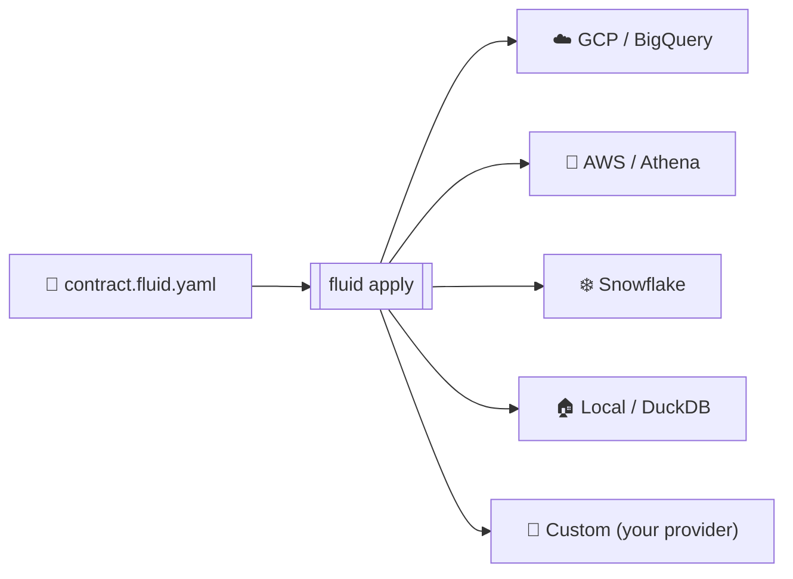

<div class="badges" style="text-align: center; margin-bottom: 2rem;">

[](https://pypi.org/project/data-product-forge/)
[](https://www.python.org/)
[](https://github.com/Agentics-Rising/forge-cli/blob/main/LICENSE)
[](https://github.com/Agentics-Rising/forge-cli/actions/workflows/ci.yml)
[](https://github.com/Agentics-Rising/forge-cli/stargazers)
[](https://pypi.org/project/data-product-forge/)
[](https://github.com/Agentics-Rising/forge-cli/commits/main)
[](https://github.com/Agentics-Rising/forge-cli/issues?q=is%3Aopen+is%3Aissue+label%3A%22good+first+issue%22)

</div>

## Why Fluid Forge?

<table style="margin: 2rem 0;">
<tr>
<td align="center" width="25%">
<strong>1 file. 4 clouds.<br>0 rewrites.</strong>
<br><br>
<sub>One YAML contract. Swap <code>provider:</code> and ship. Same guarantees, infinite scale.</sub>
</td>
<td align="center" width="25%">
<strong>Validate &rarr;<br>deploy in 30s.</strong>
<br><br>
<sub>Local DuckDB out of the box. No cloud account, no credit card, no config hell.</sub>
</td>
<td align="center" width="25%">
<strong>Real cloud IAM,<br>auto-generated.</strong>
<br><br>
<sub>Write the access policy once → emits BigQuery / Snowflake / AWS IAM JSON ready to apply.</sub>
</td>
<td align="center" width="25%">
<strong>Block AI from<br>reading PII.</strong>
<br><br>
<sub>Declare which LLMs can see which fields — enforced before the model gets the row.</sub>
</td>
</tr>
</table>

Every cloud wants you locked in. Every SDK wants you to rewrite everything when you switch providers. **Fluid Forge says no.**

Write one declarative YAML contract. Deploy it to any cloud. Move between providers in seconds. This is **Infrastructure-as-Code for data engineering** — and it actually works.

::: tip New here? What's a data product?
A *data product* is a governed, versioned dataset with a contract — its schema, quality rules, ownership, and who's allowed to read it. Think "API for data" instead of "spreadsheet emailed around." Every Fluid Forge contract describes exactly one data product end-to-end.
:::

<div class="comparison">

::: code-group

```python [❌ The Hard Way — 100+ lines per cloud]
from google.cloud import bigquery, storage

client = bigquery.Client(project='my-project')
dataset = bigquery.Dataset(client.dataset('analytics'))
dataset.location = 'US'
dataset.description = 'Customer analytics data'
client.create_dataset(dataset, exists_ok=True)

table_ref = dataset.table('customers')
schema = [
    bigquery.SchemaField('id', 'INTEGER', mode='REQUIRED'),
    bigquery.SchemaField('name', 'STRING', mode='REQUIRED'),
    bigquery.SchemaField('email', 'STRING', mode='REQUIRED'),
]
table = bigquery.Table(table_ref, schema=schema)
client.create_table(table, exists_ok=True)
# ... 80 more lines of IAM, monitoring, error handling
# ... then rewrite everything for AWS and Snowflake
```

```yaml [✅ Fluid Forge — One contract for every cloud]
# contract.fluid.yaml
fluidVersion: "0.7.2"           # contract schema version (CLI is 0.7.9)
kind: DataProduct
id: analytics.customers
name: Customer Analytics
domain: customer

metadata:
  layer: Gold
  owner:
    team: data-engineering
    email: data-eng@company.com

exposes:
  - exposeId: customers_table
    kind: table
    binding:
      platform: gcp              # ← swap to aws, snowflake, or local
      format: bigquery_table
      location:
        project: my-project
        dataset: analytics
        table: customers
    contract:
      schema:
        - name: id
          type: INTEGER
          required: true
        - name: name
          type: STRING
          required: true
        - name: email
          type: STRING
          required: true
          sensitivity: pii       # ← triggers auto-masking on cloud IAM

accessPolicy:
  grants:
    - principal: "group:analysts@company.com"
      permissions: ["read"]
```

:::

</div>

Then deploy with one command:

```bash
fluid apply contract.fluid.yaml --yes
```

That same contract deploys to GCP, AWS, Snowflake, or runs locally on DuckDB — **zero code changes**.

## How it flows

One contract. Any target. No conditional code in your pipeline.



## Quick Start

```bash
# Install
pip install data-product-forge

# Create a project with sample data
fluid init my-project --quickstart
cd my-project

# Validate and run — no cloud account needed
fluid validate contract.fluid.yaml
fluid apply contract.fluid.yaml --yes
```

That's it. A working data product on your laptop in under 2 minutes — no cloud account, no credit card, no config hell. When you're ready for production, change `platform: local` to `platform: gcp` and run the exact same command.

::: tip Ready to dive deeper?
[Full Getting Started Guide →](/getting-started/)
:::

## 🎁 Built with Fluid Forge

Real, runnable example projects you can clone and adapt today.

<table style="margin: 2rem 0;">
<tr>
<td align="center" width="33%" valign="top">
<strong>🏠 Bitcoin Tracker — Local</strong><br>
<sub>Hourly BTC price ingest, all on DuckDB. No cloud account.</sub><br><br>
<a href="/walkthrough/local">→ Walkthrough</a>
</td>
<td align="center" width="33%" valign="top">
<strong>☁️ Bitcoin Tracker — GCP</strong><br>
<sub>Same contract, deployed to BigQuery + GCS. One-line provider swap.</sub><br><br>
<a href="/walkthrough/gcp">→ Walkthrough</a>
</td>
<td align="center" width="33%" valign="top">
<strong>❄️ Bitcoin Tracker — Snowflake</strong><br>
<sub>Same contract, this time on Snowflake. Zero rewrite.</sub><br><br>
<a href="/walkthrough/snowflake">→ Walkthrough</a>
</td>
</tr>
<tr>
<td align="center" width="33%" valign="top">
<strong>🔁 Universal CI/CD</strong><br>
<sub>One Jenkinsfile. Every provider. Zero branching logic.</sub><br><br>
<a href="/walkthrough/universal-pipeline">→ Walkthrough</a>
</td>
<td align="center" width="33%" valign="top">
<strong>📦 Orchestration Export</strong><br>
<sub>Generate Airflow DAGs, Dagster graphs, Prefect flows from a contract.</sub><br><br>
<a href="/walkthrough/export-orchestration">→ Walkthrough</a>
</td>
<td align="center" width="33%" valign="top">
<strong>🤖 Declarative Airflow</strong><br>
<sub>Compose Airflow tasks from contracts — no hand-wired DAGs.</sub><br><br>
<a href="/walkthrough/airflow-declarative">→ Walkthrough</a>
</td>
</tr>
</table>

## Platform Support

| Platform | Deploy | IAM / RBAC | Airflow Gen | Key Services |
|----------|--------|-----------|-------------|-------------|
| **[GCP](/providers/gcp)** | ✅ Production | ✅ | ✅ | BigQuery, GCS, IAM |
| **[AWS](/providers/aws)** | ✅ Production | ✅ | ✅ | S3, Glue, Athena, IAM |
| **[Snowflake](/providers/snowflake)** | ✅ Production | ✅ | ✅ | Databases, Schemas, RBAC |
| **[Local](/providers/local)** | ✅ Production | — | — | DuckDB, CSV, Parquet |
| **Azure** | 🔜 Planned | 🔜 | 🔜 | Synapse, Data Lake |

All cloud providers use the **same CLI commands** and the **same CI/CD pipeline** — see [Universal Pipeline](/walkthrough/universal-pipeline).

## What's In the Box

| Feature | Description |
|---------|-------------|
| **44 CLI commands** | `validate`, `plan`, `apply`, `verify`, `generate-airflow`, `export`, `policy-check`, and more |
| **Blueprints** | Pre-built templates: `customer-360`, `enterprise-snowflake`, analytics starters |
| **AI Copilot** | `fluid forge --mode copilot` — adaptive interview, discovery, validation/repair, then scaffolding |
| **Governance Engine** | Access policies, sovereignty controls, data classification, compliance checks |
| **Orchestration Export** | Generate Airflow DAGs, Dagster pipelines, and Prefect flows from contracts |
| **Open Standards** | Export to ODPS v4.1, ODCS v3.1, and data mesh catalogs |
| **Custom Providers** | Build your own provider with ~40 lines of Python using the [Provider SDK](/providers/custom-providers) |
| **Universal CI/CD** | One Jenkinsfile that works for every provider — [zero branching logic](/walkthrough/universal-pipeline) |

## Who Uses Fluid Forge?

| Role | How Fluid Forge Helps |
|------|----------------------|
| **Data Engineers** | Build production pipelines without wrestling with cloud SDKs |
| **Analytics Teams** | Create self-service data products with governance built-in |
| **Platform Teams** | Standardize data infrastructure across the entire org |
| **Data Scientists** | Deploy ML feature pipelines with proper contracts and testing |

## Next Steps

<div class="next-steps">

**New here?** Start with the [Getting Started Guide](/getting-started/) — 2 minutes, no cloud account needed.

**Want a hands-on example?** [Local Walkthrough](/walkthrough/local) — build a Netflix analytics pipeline from scratch.

**Going to production?** Pick your cloud: [GCP](/providers/gcp) · [AWS](/providers/aws) · [Snowflake](/providers/snowflake)

**Setting up CI/CD?** [Universal Pipeline](/walkthrough/universal-pipeline) — one config file for every provider.

**Want to contribute?** [Contributing Guide](/contributing) · [GitHub](https://github.com/Agentics-Rising/forge-cli)

</div>

---

## 💛 Built by the community, for the community

<p style="text-align: center;">
  Every typo fix, new walkthrough, and clarifying example makes Fluid Forge better.<br>
  We welcome contributions of all sizes — from a single comma to a whole new provider.
</p>

<table style="margin: 2rem 0;">
<tr>
<td align="center" width="33%" valign="top">
<strong>💬 Discuss</strong><br>
<sub>Ask questions, share what you're building, propose ideas.</sub><br><br>
<a href="https://github.com/Agentics-Rising/forge-cli/discussions">→ GitHub Discussions</a>
</td>
<td align="center" width="33%" valign="top">
<strong>🐣 Get involved</strong><br>
<sub>Curated starter tasks for first-time contributors.</sub><br><br>
<a href="https://github.com/Agentics-Rising/forge-cli/issues?q=is%3Aopen+is%3Aissue+label%3A%22good+first+issue%22">→ Good first issues</a>
</td>
<td align="center" width="33%" valign="top">
<strong>📘 Contribute</strong><br>
<sub>Workflow, conventions, and what we look for in PRs.</sub><br><br>
<a href="/contributing">→ Contributing Guide</a>
</td>
</tr>
</table>

---

<div class="about-section" style="text-align: center; padding: 2rem 0 1rem; opacity: 0.85;">

**Developed with pride by [DustLabs](https://dustlabs.co.za/)** ·
Copyright 2025-2026 [Agentics Transformation Pty Ltd](https://github.com/Agentics-Rising) · Open source under [Apache 2.0](https://github.com/Agentics-Rising/forge-cli/blob/main/LICENSE)

</div>

<style>
.badges img {
  display: inline-block;
  margin: 0 4px;
}

.next-steps {
  background: var(--c-bg-light);
  border-left: 4px solid var(--c-brand);
  padding: 1.5rem;
  margin: 2rem 0;
  border-radius: 4px;
}

.next-steps p {
  margin: 0.75rem 0;
  font-size: 1.05rem;
}
</style>
