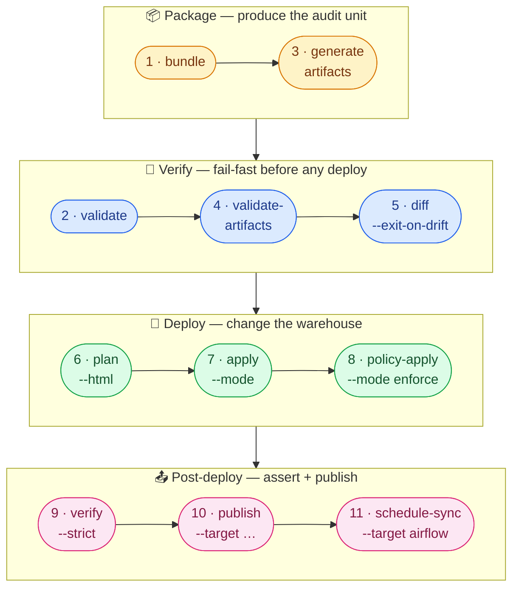

# Universal Pipeline

One contract, one canonical 11-stage flow, every CI runner. Auto-generate the runner-specific artifact with `fluid generate ci --target <runner>` — the stages, flags, and gates are identical no matter where they execute.

**Status:** ✅ Production (verified against `data-product-forge==0.8.0`)
**Supported runners:** GitHub Actions · GitLab CI · Jenkins · Azure DevOps · Bitbucket Pipelines · CircleCI · Tekton

---

## The canonical 11-stage pipeline

The v0.8.0 production flow is **eleven sequential stages**, each a CI gate that either advances or aborts. The order is **load-bearing** — earlier stages produce artifacts that later stages verify, sign, and deploy.



::: tip Reading the diagram
Stage numbers reflect the actual execution order (`bundle` is stage 1, `validate` is stage 2, `generate artifacts` is stage 3 — even though they're grouped by phase visually). Each phase fails fast before the next starts: a broken bundle never reaches `validate`, drift never reaches `apply`, an apply that didn't take never reaches `publish`.
:::

### Stage-by-stage

| # | Stage | Command | What it does | What it gates |
|---|-------|---------|--------------|---------------|
| 1 | **bundle** | `fluid bundle <contract> --sign --attest --format tgz` | Package contract + sources into a signed `.tgz` bundle with cosign signature + SLSA attestation | Provenance — every downstream stage operates on this signed artifact |
| 2 | **validate** | `fluid validate <bundle> --strict --report` | Check contract syntax, schema compliance, provider rules | Stops malformed contracts before any artifact is generated |
| 3 | **generate artifacts** | `fluid generate artifacts <bundle>` | Fanout to ODCS + ODPS-Bitol + schedule + policy bindings | Produces every downstream artifact in one deterministic pass |
| 4 | **validate-artifacts** | `fluid validate-artifacts` | Verify MANIFEST SHA-256 + per-format schema checks on the generated artifacts | Catches tampering or generation bugs |
| 5 | **diff** | `fluid diff <bundle> --exit-on-drift` | Detect drift from the deployed state | Fails fast when state has moved out from under the contract |
| 6 | **plan** | `fluid plan <bundle> --html --env <env> --out plan.json` | Render execution plan (Mermaid DAG, JSON for review) | Manual review gate; nothing has touched the warehouse yet |
| 7 | **apply** | `fluid apply <bundle> --mode <mode> --yes` | Execute the plan: provision tables, run transformations | The actual deploy. Modes: `dry-run`, `create-only`, `amend` (default), `amend-and-build`, `replace`, `replace-and-build` |
| 8 | **policy-apply** | `fluid policy-apply <bindings.json> --mode {check,enforce}` | Apply IAM/GRANT bindings derived from `accessPolicy` | Governance enforcement. `--mode check` in non-prod, `--mode enforce` in prod |
| 9 | **verify** | `fluid verify <bundle> --strict` | Confirm deployed state matches the contract | Post-deploy assertion; fails the build if reality drifted |
| 10 | **publish** | `fluid publish <bundle> --target <catalog>` (repeatable) | Push the data product to enterprise data catalogs (Data Mesh Manager, Atlan, Collibra, ODPS registry) | Marks the deploy as discoverable |
| 11 | **schedule-sync** | `fluid schedule-sync <bundle>` | Push generated DAGs to Airflow / Composer / MWAA / Astronomer / Prefect / Dagster | Final stage — orchestrator now owns recurring runs |

::: tip Why bundle-first?
The pre-bundle world (which earlier docs versions described) treated every stage as a fresh read of the YAML. That's fragile: a contract edited mid-pipeline can pass `validate` but fail `apply` against a different shape. Since v0.8.0 the bundle is the **single audit unit** — every stage reads the same signed tgz, and anyone can replay the deploy by checking out that bundle.
:::

---

## Generate the right artifact for your runner

You don't write any of these pipelines by hand. `fluid generate ci` reads the contract and emits the runner-specific configuration:

```bash
fluid generate ci contract.fluid.yaml --target github      # .github/workflows/fluid.yml
fluid generate ci contract.fluid.yaml --target gitlab      # .gitlab-ci.yml
fluid generate ci contract.fluid.yaml --target jenkins     # Jenkinsfile
fluid generate ci contract.fluid.yaml --target azure       # azure-pipelines.yml
fluid generate ci contract.fluid.yaml --target bitbucket   # bitbucket-pipelines.yml
fluid generate ci contract.fluid.yaml --target circleci    # .circleci/config.yml
fluid generate ci contract.fluid.yaml --target tekton      # tekton/pipeline.yaml
```

The examples below show the canonical output for the three most-used runners. Use them as drop-in starting points or regenerate with `fluid generate ci` whenever the canonical flow evolves.

---

## GitHub Actions

Save as `.github/workflows/fluid.yml`:

```yaml
name: FLUID Universal Pipeline

on:
  push:
    branches: [main, develop]
  pull_request:
    branches: [main]
  workflow_dispatch:

env:
  CONTRACT_FILE: contract.fluid.yaml
  ENV: ${{ github.ref_name == 'main' && 'prod' || github.ref_name == 'develop' && 'staging' || 'dev' }}

jobs:
  fluid-pipeline:
    runs-on: ubuntu-latest
    timeout-minutes: 30
    permissions:
      contents: read
      id-token: write           # for cosign keyless signing in stage 1
      packages: write           # for the signed bundle attestation
      attestations: write       # SLSA provenance

    steps:
      # ── 0. Setup ────────────────────────────────────────
      - uses: actions/checkout@v4
      - uses: actions/setup-python@v5
        with:
          python-version: "3.11"

      - name: Install FLUID CLI
        run: pip install --upgrade pip && pip install "data-product-forge[local,gcp,aws,snowflake]"

      - name: Resolve credentials
        run: |
          # Provider-agnostic credential pickup — populate .fluid-env from the
          # secret your branch is targeting. Add only the secrets you actually use.
          {
            [[ -n "${{ secrets.GOOGLE_APPLICATION_CREDENTIALS_JSON }}" ]] && \
              echo "${{ secrets.GOOGLE_APPLICATION_CREDENTIALS_JSON }}" > .gcp-key.json && \
              echo "GOOGLE_APPLICATION_CREDENTIALS=$PWD/.gcp-key.json"
            [[ -n "${{ secrets.AWS_ACCESS_KEY_ID }}" ]] && echo "AWS_ACCESS_KEY_ID=${{ secrets.AWS_ACCESS_KEY_ID }}"
            [[ -n "${{ secrets.AWS_SECRET_ACCESS_KEY }}" ]] && echo "AWS_SECRET_ACCESS_KEY=${{ secrets.AWS_SECRET_ACCESS_KEY }}"
            [[ -n "${{ secrets.AWS_REGION }}" ]] && echo "AWS_REGION=${{ secrets.AWS_REGION }}"
            [[ -n "${{ secrets.SNOWFLAKE_ACCOUNT }}" ]] && echo "SNOWFLAKE_ACCOUNT=${{ secrets.SNOWFLAKE_ACCOUNT }}"
            [[ -n "${{ secrets.SNOWFLAKE_USER }}" ]] && echo "SNOWFLAKE_USER=${{ secrets.SNOWFLAKE_USER }}"
            [[ -n "${{ secrets.SNOWFLAKE_PASSWORD }}" ]] && echo "SNOWFLAKE_PASSWORD=${{ secrets.SNOWFLAKE_PASSWORD }}"
          } > .fluid-env

      # ── 1. Bundle (sign + attest) ───────────────────────
      - name: 1️⃣  Bundle
        run: |
          set -a; . .fluid-env; set +a
          fluid bundle "$CONTRACT_FILE" --sign --attest --format tgz \
            --out bundle/contract.tgz

      # ── 2. Validate ─────────────────────────────────────
      - name: 2️⃣  Validate
        run: |
          set -a; . .fluid-env; set +a
          fluid validate bundle/contract.tgz --strict --report reports/validation.json

      # ── 3. Generate artifacts ───────────────────────────
      - name: 3️⃣  Generate artifacts
        run: |
          set -a; . .fluid-env; set +a
          fluid generate artifacts bundle/contract.tgz --out artifacts/

      # ── 4. Validate artifacts ───────────────────────────
      - name: 4️⃣  Validate artifacts
        run: |
          fluid validate-artifacts artifacts/MANIFEST.json --strict

      # ── 5. Diff (drift detection) ───────────────────────
      - name: 5️⃣  Diff
        if: env.ENV != 'dev'
        run: |
          set -a; . .fluid-env; set +a
          fluid diff bundle/contract.tgz --env "$ENV" --exit-on-drift

      # ── 6. Plan ─────────────────────────────────────────
      - name: 6️⃣  Plan
        run: |
          set -a; . .fluid-env; set +a
          fluid plan bundle/contract.tgz --env "$ENV" --html --out plans/plan-$ENV.json

      - name: Comment plan on PR
        if: github.event_name == 'pull_request'
        uses: actions/upload-artifact@v4
        with:
          name: fluid-plan
          path: plans/

      # ── 7. Apply ────────────────────────────────────────
      - name: 7️⃣  Apply
        if: github.event_name != 'pull_request'
        run: |
          set -a; . .fluid-env; set +a
          MODE=${{ env.ENV == 'prod' && 'amend' || 'amend-and-build' }}
          fluid apply bundle/contract.tgz --env "$ENV" --mode "$MODE" --yes

      # ── 8. Policy-apply ─────────────────────────────────
      - name: 8️⃣  Policy-apply
        if: github.event_name != 'pull_request'
        run: |
          set -a; . .fluid-env; set +a
          MODE=${{ env.ENV == 'prod' && 'enforce' || 'check' }}
          fluid policy-apply artifacts/policy/bindings.json --mode "$MODE"

      # ── 9. Verify ───────────────────────────────────────
      - name: 9️⃣  Verify
        if: github.event_name != 'pull_request'
        run: |
          set -a; . .fluid-env; set +a
          fluid verify bundle/contract.tgz --env "$ENV" --strict

      # ── 10. Publish ─────────────────────────────────────
      - name: 🔟  Publish
        if: github.event_name != 'pull_request' && env.ENV == 'prod'
        run: |
          set -a; . .fluid-env; set +a
          fluid publish bundle/contract.tgz \
            --target datamesh-manager \
            --target opds-registry

      # ── 11. Schedule-sync ───────────────────────────────
      - name: 1️⃣1️⃣  Schedule-sync
        if: github.event_name != 'pull_request' && env.ENV == 'prod'
        run: |
          set -a; . .fluid-env; set +a
          fluid schedule-sync bundle/contract.tgz --target airflow

      # ── Cleanup ─────────────────────────────────────────
      - name: Archive artifacts
        if: always()
        uses: actions/upload-artifact@v4
        with:
          name: fluid-pipeline-${{ env.ENV }}
          path: |
            bundle/
            artifacts/
            reports/
            plans/
          retention-days: 30

      - name: Cleanup secrets
        if: always()
        run: rm -f .fluid-env .gcp-key.json
```

::: tip GitHub Actions specifics
- **`id-token: write`** is required by stage 1 for cosign keyless signing. Without it, `fluid bundle --sign` falls back to local-only signing.
- **PR vs push behavior** — pull-request runs stop after stage 6 (Plan). Push to `main`/`develop` runs all 11. The plan artifact is uploaded so reviewers can inspect it in the PR.
- **Environment-aware modes** — production uses `apply --mode amend` (no transform refresh) + `policy-apply --mode enforce`. Non-prod uses `--mode amend-and-build` (refreshes transforms) + `policy-apply --mode check` (dry-run).
:::

---

## GitLab CI

Save as `.gitlab-ci.yml`:

```yaml
# FLUID Universal Pipeline — GitLab CI
# Each stage maps to a v0.8.0 canonical CI gate.

stages:
  - bundle
  - validate
  - artifacts
  - validate-artifacts
  - diff
  - plan
  - apply
  - policy-apply
  - verify
  - publish
  - schedule-sync

variables:
  CONTRACT_FILE: "contract.fluid.yaml"
  PIP_CACHE_DIR: "$CI_PROJECT_DIR/.cache/pip"

default:
  image: python:3.11-slim
  cache:
    paths:
      - .cache/pip
  before_script:
    - pip install --quiet --upgrade pip
    - pip install --quiet "data-product-forge[local,gcp,aws,snowflake]"
    # Resolve env from CI/CD variables — populate .fluid-env
    - |
      {
        [ -n "$GOOGLE_APPLICATION_CREDENTIALS_JSON" ] && echo "$GOOGLE_APPLICATION_CREDENTIALS_JSON" > .gcp-key.json && echo "GOOGLE_APPLICATION_CREDENTIALS=$PWD/.gcp-key.json"
        [ -n "$AWS_ACCESS_KEY_ID" ] && echo "AWS_ACCESS_KEY_ID=$AWS_ACCESS_KEY_ID"
        [ -n "$AWS_SECRET_ACCESS_KEY" ] && echo "AWS_SECRET_ACCESS_KEY=$AWS_SECRET_ACCESS_KEY"
        [ -n "$AWS_REGION" ] && echo "AWS_REGION=$AWS_REGION"
        [ -n "$SNOWFLAKE_ACCOUNT" ] && echo "SNOWFLAKE_ACCOUNT=$SNOWFLAKE_ACCOUNT"
        [ -n "$SNOWFLAKE_USER" ] && echo "SNOWFLAKE_USER=$SNOWFLAKE_USER"
        [ -n "$SNOWFLAKE_PASSWORD" ] && echo "SNOWFLAKE_PASSWORD=$SNOWFLAKE_PASSWORD"
      } > .fluid-env
    - |
      case "$CI_COMMIT_REF_NAME" in
        main)    echo "ENV=prod"   >> .fluid-env ;;
        develop) echo "ENV=staging" >> .fluid-env ;;
        *)       echo "ENV=dev"    >> .fluid-env ;;
      esac

# ── 1. Bundle ────────────────────────────────────────
bundle:
  stage: bundle
  script:
    - set -a; . .fluid-env; set +a
    - fluid bundle "$CONTRACT_FILE" --sign --attest --format tgz --out bundle/contract.tgz
  artifacts:
    paths: [bundle/]
    expire_in: 1 week

# ── 2. Validate ──────────────────────────────────────
validate:
  stage: validate
  needs: [bundle]
  script:
    - set -a; . .fluid-env; set +a
    - fluid validate bundle/contract.tgz --strict --report reports/validation.json
  artifacts:
    paths: [reports/]
    when: always

# ── 3. Generate artifacts ────────────────────────────
generate-artifacts:
  stage: artifacts
  needs: [validate]
  script:
    - set -a; . .fluid-env; set +a
    - fluid generate artifacts bundle/contract.tgz --out artifacts/
  artifacts:
    paths: [artifacts/]
    expire_in: 1 week

# ── 4. Validate artifacts ────────────────────────────
validate-artifacts:
  stage: validate-artifacts
  needs: [generate-artifacts]
  script:
    - fluid validate-artifacts artifacts/MANIFEST.json --strict

# ── 5. Diff (drift) ──────────────────────────────────
diff:
  stage: diff
  needs: [validate-artifacts]
  rules:
    - if: '$CI_COMMIT_REF_NAME != "feature/.*"'
  script:
    - set -a; . .fluid-env; set +a
    - fluid diff bundle/contract.tgz --env "$ENV" --exit-on-drift

# ── 6. Plan ──────────────────────────────────────────
plan:
  stage: plan
  needs: [diff]
  script:
    - set -a; . .fluid-env; set +a
    - fluid plan bundle/contract.tgz --env "$ENV" --html --out plans/plan-$ENV.json
  artifacts:
    paths: [plans/]
    expose_as: 'fluid-plan'

# ── 7. Apply ─────────────────────────────────────────
apply:
  stage: apply
  needs: [plan]
  rules:
    - if: '$CI_PIPELINE_SOURCE != "merge_request_event"'
  script:
    - set -a; . .fluid-env; set +a
    - MODE=$([ "$ENV" = "prod" ] && echo "amend" || echo "amend-and-build")
    - fluid apply bundle/contract.tgz --env "$ENV" --mode "$MODE" --yes

# ── 8. Policy-apply ──────────────────────────────────
policy-apply:
  stage: policy-apply
  needs: [apply]
  rules:
    - if: '$CI_PIPELINE_SOURCE != "merge_request_event"'
  script:
    - set -a; . .fluid-env; set +a
    - MODE=$([ "$ENV" = "prod" ] && echo "enforce" || echo "check")
    - fluid policy-apply artifacts/policy/bindings.json --mode "$MODE"

# ── 9. Verify ────────────────────────────────────────
verify:
  stage: verify
  needs: [policy-apply]
  rules:
    - if: '$CI_PIPELINE_SOURCE != "merge_request_event"'
  script:
    - set -a; . .fluid-env; set +a
    - fluid verify bundle/contract.tgz --env "$ENV" --strict

# ── 10. Publish ──────────────────────────────────────
publish:
  stage: publish
  needs: [verify]
  rules:
    - if: '$CI_COMMIT_REF_NAME == "main"'
  script:
    - set -a; . .fluid-env; set +a
    - fluid publish bundle/contract.tgz --target datamesh-manager --target opds-registry

# ── 11. Schedule-sync ────────────────────────────────
schedule-sync:
  stage: schedule-sync
  needs: [publish]
  rules:
    - if: '$CI_COMMIT_REF_NAME == "main"'
  script:
    - set -a; . .fluid-env; set +a
    - fluid schedule-sync bundle/contract.tgz --target airflow

# Cleanup runs even on failure
.cleanup:
  after_script:
    - rm -f .fluid-env .gcp-key.json
```

::: tip GitLab CI specifics
- **`needs:`** chains the stages so they run sequentially with explicit artifact propagation. The bundle from stage 1 flows through every later stage as the canonical audit unit.
- **`rules:`** gates `apply` / `policy-apply` / `verify` to push pipelines (not MR pipelines), and `publish` / `schedule-sync` to `main` only.
- **`expose_as:`** on the plan stage makes the plan artifact one-click accessible from the MR widget — reviewers click "View exposed artifact" without leaving GitLab.
:::

---

## Jenkins

Save as `Jenkinsfile`:

```groovy
#!/usr/bin/env groovy
/**
 * FLUID Universal Pipeline — Jenkins
 * v0.8.0 canonical 11-stage flow. Provider-agnostic, runner-agnostic.
 */

pipeline {
    agent {
        docker {
            image "${params.FLUID_IMAGE}"
            alwaysPull true
            args '--entrypoint='
        }
    }

    environment {
        HOME = "${WORKSPACE}"
        ENV  = "${BRANCH_NAME == 'main' ? 'prod' : BRANCH_NAME == 'develop' ? 'staging' : 'dev'}"
    }

    parameters {
        string(name: 'CONTRACT_FILE',  defaultValue: 'contract.fluid.yaml',
               description: 'FLUID contract file')
        string(name: 'FLUID_IMAGE',    defaultValue: 'ghcr.io/agentics-rising/forge-cli:0.8.0',
               description: 'FLUID CLI Docker image')
        string(name: 'CREDENTIALS_ID', defaultValue: '',
               description: 'Jenkins Secret File credential ID')
        booleanParam(name: 'PUBLISH',       defaultValue: false,
               description: 'Run stages 10-11 (publish + schedule-sync)')
    }

    options {
        timeout(time: 30, unit: 'MINUTES')
        buildDiscarder(logRotator(numToKeepStr: '20'))
        disableConcurrentBuilds()
    }

    stages {

        // ── 0. Setup: load credentials, detect format ─────
        stage('Setup') {
            steps {
                script {
                    if (params.CREDENTIALS_ID) {
                        withCredentials([file(credentialsId: params.CREDENTIALS_ID,
                                              variable: 'CREDS_FILE')]) {
                            sh 'cp $CREDS_FILE $WORKSPACE/.fluid-creds'
                        }
                    }
                }
                sh '''
                    if [ -f .fluid-creds ]; then
                        if python3 -c "import json; d=json.load(open('.fluid-creds')); \
                           assert d.get('type')=='service_account'" 2>/dev/null; then
                            cp .fluid-creds .gcp-key.json
                            PROJECT=$(python3 -c "import json; \
                              print(json.load(open('.gcp-key.json')).get('project_id',''))")
                            printf "GOOGLE_APPLICATION_CREDENTIALS=%s/.gcp-key.json\nGCP_PROJECT=%s\n" \
                              "$WORKSPACE" "$PROJECT" > .fluid-env
                        else
                            grep -v '^#' .fluid-creds | grep -v '^$' | sed 's/^export //' > .fluid-env
                        fi
                    else
                        touch .fluid-env
                    fi
                '''
            }
        }

        // ── 1. Bundle ────────────────────────────────────
        stage('1️⃣  Bundle') {
            steps {
                sh '''
                    set -a; . .fluid-env; set +a
                    fluid bundle ${CONTRACT_FILE} --sign --attest --format tgz \
                      --out bundle/contract.tgz
                '''
            }
        }

        // ── 2. Validate ──────────────────────────────────
        stage('2️⃣  Validate') {
            steps {
                sh '''
                    set -a; . .fluid-env; set +a
                    mkdir -p reports
                    fluid validate bundle/contract.tgz --strict --report reports/validation.json
                '''
            }
        }

        // ── 3. Generate artifacts ────────────────────────
        stage('3️⃣  Generate artifacts') {
            steps {
                sh '''
                    set -a; . .fluid-env; set +a
                    fluid generate artifacts bundle/contract.tgz --out artifacts/
                '''
            }
        }

        // ── 4. Validate artifacts ────────────────────────
        stage('4️⃣  Validate artifacts') {
            steps {
                sh 'fluid validate-artifacts artifacts/MANIFEST.json --strict'
            }
        }

        // ── 5. Diff (drift) ──────────────────────────────
        stage('5️⃣  Diff') {
            when { expression { env.ENV != 'dev' } }
            steps {
                sh '''
                    set -a; . .fluid-env; set +a
                    fluid diff bundle/contract.tgz --env ${ENV} --exit-on-drift
                '''
            }
        }

        // ── 6. Plan ──────────────────────────────────────
        stage('6️⃣  Plan') {
            steps {
                sh '''
                    set -a; . .fluid-env; set +a
                    mkdir -p plans
                    fluid plan bundle/contract.tgz --env ${ENV} --html \
                      --out plans/plan-${ENV}.json
                '''
            }
        }

        // ── 7. Apply ─────────────────────────────────────
        stage('7️⃣  Apply') {
            steps {
                sh '''
                    set -a; . .fluid-env; set +a
                    MODE=$([ "${ENV}" = "prod" ] && echo amend || echo amend-and-build)
                    fluid apply bundle/contract.tgz --env ${ENV} --mode ${MODE} --yes
                '''
            }
        }

        // ── 8. Policy-apply ──────────────────────────────
        stage('8️⃣  Policy-apply') {
            steps {
                sh '''
                    set -a; . .fluid-env; set +a
                    MODE=$([ "${ENV}" = "prod" ] && echo enforce || echo check)
                    fluid policy-apply artifacts/policy/bindings.json --mode ${MODE}
                '''
            }
        }

        // ── 9. Verify ────────────────────────────────────
        stage('9️⃣  Verify') {
            steps {
                sh '''
                    set -a; . .fluid-env; set +a
                    fluid verify bundle/contract.tgz --env ${ENV} --strict
                '''
            }
        }

        // ── 10. Publish ──────────────────────────────────
        stage('🔟  Publish') {
            when { expression { params.PUBLISH && env.ENV == 'prod' } }
            steps {
                sh '''
                    set -a; . .fluid-env; set +a
                    fluid publish bundle/contract.tgz \
                      --target datamesh-manager \
                      --target opds-registry
                '''
            }
        }

        // ── 11. Schedule-sync ────────────────────────────
        stage('1️⃣1️⃣  Schedule-sync') {
            when { expression { params.PUBLISH && env.ENV == 'prod' } }
            steps {
                sh '''
                    set -a; . .fluid-env; set +a
                    fluid schedule-sync bundle/contract.tgz --target airflow
                '''
            }
        }
    }

    post {
        always {
            archiveArtifacts artifacts: 'bundle/**, artifacts/**, reports/**, plans/**',
                             allowEmptyArchive: true
            sh 'rm -f .fluid-creds .fluid-env .gcp-key.json 2>/dev/null || true'
            cleanWs()
        }
    }
}
```

::: tip Jenkins specifics
- **Single Secret File credential** per environment — the pipeline auto-detects whether it's a GCP SA JSON key or a key=value env file (AWS, Snowflake, anything else).
- **`when { expression { ... } }`** gates publish + schedule-sync behind a parameter so the pipeline can be re-run without re-publishing.
- **`disableConcurrentBuilds()`** prevents two `apply` stages from racing each other on the same target.
:::

---

## Other runners — same stages, generated automatically

The remaining four runners follow exactly the same 11-stage flow. `fluid generate ci` produces working configs that respect each runner's idioms:

### Azure DevOps Pipelines

```bash
fluid generate ci contract.fluid.yaml --target azure
# Produces: azure-pipelines.yml with `stages:` for each canonical step,
# variable-group references for credentials, and stage gates that map to
# Azure environment approvals.
```

### Bitbucket Pipelines

```bash
fluid generate ci contract.fluid.yaml --target bitbucket
# Produces: bitbucket-pipelines.yml with `pipelines.default` running stages
# 1-6 on PRs and `pipelines.branches.main` running stages 7-11.
# Repository Variables are read for credentials.
```

### CircleCI

```bash
fluid generate ci contract.fluid.yaml --target circleci
# Produces: .circleci/config.yml using workflows + jobs, with
# environment-context-based credentials and `requires:` chaining.
```

### Tekton

```bash
fluid generate ci contract.fluid.yaml --target tekton
# Produces: tekton/pipeline.yaml + per-stage Task definitions.
# Designed for Kubernetes-native flows with Workspace-mounted credentials.
```

::: tip Same stages, different syntax
The four runners above (Azure / Bitbucket / CircleCI / Tekton) execute exactly the same 11 `fluid` commands as GitHub Actions / GitLab / Jenkins above. **The pipeline shape is the contract** — whichever runner you choose just rephrases how to express it. Adding a new runner means adding a template to `fluid generate ci`, not changing the pipeline definition.
:::

---

## Side-by-side: same pipeline, different clouds

The pipeline **never changes**. Only the contract and credentials differ.

### What differs per provider

| | GCP | AWS | Snowflake | Local (DuckDB) |
|---|-----|-----|-----------|----------------|
| **Contract** | `binding.platform: gcp` | `binding.platform: aws` | `binding.platform: snowflake` | `binding.platform: local` |
| **Format** | `bigquery_table` | `s3_file` (Athena reads via Glue) | `snowflake_table` | `parquet` / `csv` |
| **Location** | `project`, `dataset`, `table`, `region` | `bucket`, `prefix`, `region` | `database`, `schema`, `table` | `path` |
| **Secret payload** | SA JSON key | `AWS_ACCESS_KEY_ID` + `AWS_SECRET_ACCESS_KEY` + `AWS_REGION` | `SNOWFLAKE_ACCOUNT` + `SNOWFLAKE_USER` + `SNOWFLAKE_PASSWORD` + `SNOWFLAKE_WAREHOUSE` + `SNOWFLAKE_ROLE` | None (runs in-process) |
| **IAM output** | BigQuery `dataViewer` / `dataOwner` grants | S3 + Glue + Athena resource policies | Snowflake `GRANT SELECT/INSERT/USAGE` | n/a |
| **Pipeline file** | **Identical** | **Identical** | **Identical** | **Identical** |
| **CLI commands** | **Identical** | **Identical** | **Identical** | **Identical** |

### Credential auto-detection

All three reference pipelines (GitHub / GitLab / Jenkins) use the **same credential pickup pattern**:

```bash
if file_is_json_with_type_service_account:
    # GCP path
    export GOOGLE_APPLICATION_CREDENTIALS=.gcp-key.json
    export GCP_PROJECT=$(json .project_id)
else:
    # Everything else — AWS, Snowflake, Azure, Databricks, custom providers
    source the key=value pairs as env vars
```

This means **adding a new provider** requires zero pipeline-file changes:

1. Implement the provider in the CLI (`fluid_build/providers/`) or install it via the [Provider SDK](/providers/custom-providers)
2. Set `binding.platform` in the contract
3. Create a credentials secret with the env vars your provider needs
4. Push — the same pipeline runs

---

## Per-runner credential conventions

Drop-in references for where to store each provider's secrets in each runner:

| Runner | Credential mechanism | Naming convention |
|--------|---------------------|-------------------|
| **GitHub Actions** | Repository / Environment Secrets | `GOOGLE_APPLICATION_CREDENTIALS_JSON`, `AWS_ACCESS_KEY_ID`, `SNOWFLAKE_ACCOUNT`, ... |
| **GitLab CI** | CI/CD Variables (Settings → CI/CD → Variables, scoped to Environment) | Same env-var names as GitHub |
| **Jenkins** | Credentials → Secret File (one per environment) | Single multi-line file with `KEY=VALUE` rows or raw GCP SA JSON |
| **Azure DevOps** | Variable Groups (linked to Pipeline) | Same env-var names; mark sensitive ones `Secret: true` |
| **Bitbucket** | Repository Variables (Settings → Pipelines → Repository variables) | Same env-var names |
| **CircleCI** | Contexts (org-level) + Project-level Environment Variables | Same env-var names |
| **Tekton** | `Secret` resources mounted as Workspaces | Each provider's vars in a single `Secret` |

---

## Stages reference

Canonical command + flag reference for each stage. These are the source of truth — the runner-specific examples above all expand to these calls.

| # | Stage | Canonical command | Key flags | When |
|---|-------|------------------|-----------|------|
| 1 | bundle | `fluid bundle <contract>` | `--sign` `--attest` `--format tgz` `--out <path>` | Always |
| 2 | validate | `fluid validate <bundle>` | `--strict` `--report <path>` | Always |
| 3 | generate artifacts | `fluid generate artifacts <bundle>` | `--out <dir>` | Always |
| 4 | validate-artifacts | `fluid validate-artifacts <manifest>` | `--strict` | Always |
| 5 | diff | `fluid diff <bundle>` | `--env <env>` `--exit-on-drift` | Skip in `dev`; required in `staging`/`prod` |
| 6 | plan | `fluid plan <bundle>` | `--env <env>` `--html` `--out <path>` | Always (artifact reviewed in PR) |
| 7 | apply | `fluid apply <bundle>` | `--env <env>` `--mode {dry-run,create-only,amend,amend-and-build,replace,replace-and-build}` `--yes` `--allow-data-loss` | Skip on PR; run on push |
| 8 | policy-apply | `fluid policy-apply <bindings.json>` | `--mode {check,enforce}` | Skip on PR; `check` non-prod, `enforce` prod |
| 9 | verify | `fluid verify <bundle>` | `--env <env>` `--strict` | Skip on PR; run after apply |
| 10 | publish | `fluid publish <bundle>` | `--target <catalog>` (repeatable) | `main` branch only |
| 11 | schedule-sync | `fluid schedule-sync <bundle>` | `--target {airflow,composer,mwaa,astronomer,prefect,dagster}` | `main` branch only |

::: tip `--mode` matrix for `apply`
- **`dry-run`** — render only, no warehouse calls
- **`create-only`** — fail if target exists; otherwise `CREATE IF NOT EXISTS`
- **`amend`** (default) — `ALTER ADD COLUMN IF NOT EXISTS`; views `CREATE OR REPLACE`; data preserved
- **`amend-and-build`** — `amend` + dbt run; transforms refreshed
- **`replace`** — auto-snapshot then `DROP+RECREATE`; requires `--allow-data-loss` outside `dev` or when target has rows
- **`replace-and-build`** — `replace` + dbt run --full-refresh
:::

---

## Migrating from older imperative pipelines

If your existing CI is the pre-v0.8.0 imperative flow (Setup → Validate → Export → Plan → Apply → IAM → Execute → Airflow), the migration is mechanical:

| Old stage | v0.8.0 canonical replacement |
|-----------|------------------------------|
| `Setup` (credential pickup) | Move into `before_script` / `Setup` step before stage 1 |
| `Validate` (`fluid validate`) | Stage 2 `validate` (now reads the bundle, not the raw YAML) |
| `Export Standards` (`fluid odps export` + `odcs export`) | Stage 3 `generate artifacts` — produces all standards in one fanout |
| (none) | Stage 4 `validate-artifacts` — **NEW**, verifies the MANIFEST hash |
| (none) | Stage 5 `diff` — **NEW**, drift detection before deploy |
| `Generate Plan` (`fluid plan`) | Stage 6 `plan` (unchanged behavior) |
| `Run Tests` (`fluid test`) | Move out of CI: `fluid test` is now a Quality gate, run interactively or as a separate workflow |
| `Apply Infrastructure` (`fluid apply`) | Stage 7 `apply` (now also covers what `fluid execute` did via `--mode amend-and-build`) |
| `Apply IAM Policies` (`fluid policy-apply`) | Stage 8 `policy-apply` |
| `Execute Builds` (`fluid execute`) | Folded into stage 7 — pass `--mode amend-and-build` to `apply` |
| (none) | Stage 9 `verify` — **NEW**, post-deploy state assertion |
| (none) | Stage 10 `publish` — **NEW**, push to data catalogs |
| `Generate Airflow DAG` (`fluid generate-airflow`) | Stage 11 `schedule-sync` — actually pushes the DAG to the orchestrator (the old stage just emitted the file) |
| `Summary` | Move into runner-native artifact archival (`actions/upload-artifact`, GitLab `artifacts:`, Jenkins `archiveArtifacts`) |

Or just regenerate from scratch:

```bash
fluid generate ci contract.fluid.yaml --target <your-runner>
```

---

## See also

- [`fluid bundle`](/cli/) — the supply-chain provenance entry point
- [`fluid generate ci`](/cli/) — auto-generate the right CI config for any supported runner
- [Concepts → Quality, SLAs & Lineage](/concepts/quality-sla-lineage) — what `validate`, `test`, `verify`, and `policy-apply` each gate against
- [Concepts → Governance & Policy](/concepts/governance-policy) — how `policy-apply --mode enforce` compiles to native cloud IAM
- [AWS Provider](/providers/aws) · [Snowflake Provider](/providers/snowflake) · [GCP Provider](/providers/gcp)
